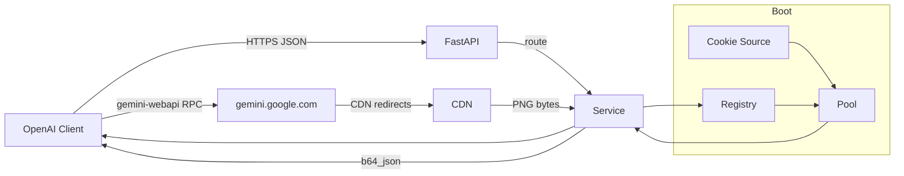
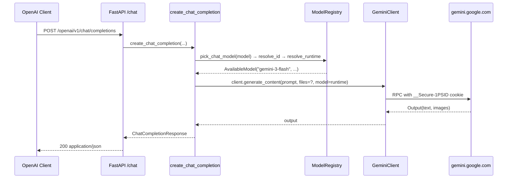

# Architecture

This document is the deep-dive companion to the README's architecture
diagram. It explains the **data flow** end-to-end, the **seams** where
pluggable backends attach, and the **registry** logic that turns upstream
model names into a small curated set the client sees.

## Bird's-eye view



The proxy is a **single FastAPI process** with a **singleton `GeminiClient`**
per cookie source. There is no per-request connection setup; the first
request triggers a one-time `gemini-webapi.init()` (bounded by
`GOP_INIT_TIMEOUT`, default 120s), and every subsequent request reuses
the same authenticated session.

## Boot sequence

```
bash scripts/docker-up.sh
  │
  ├─ (macOS only) .venv/bin/python scripts/sync_runtime_env.py --browser safari
  │     └─ writes data/runtime.env (chmod 600) with 35 cookies
  │
  ├─ docker compose up -d --build
  │     └─ buildx: pip install -e . (live source) in runtime stage
  │
  └─ container entrypoint: python -m gemini_webapi_proxy --host 0.0.0.0 --port 4982
        │
        └─ FastAPI lifespan hook (app.py:lifespan)
              │
              ├─ bootstrap_browser_cookie_session()  ← only when GOP_COOKIE_SOURCE=browser
              │
              ├─ await get_client(settings)         ← lazy singleton
              │     │
              │     └─ GeminiClient.init()  ← ONE network round to gemini.google.com
              │
              └─ registry: empty until first /openai/v1/models or /admin/probe
```

The cookie **bootstrap** is the only step that performs network I/O at
startup. After that, every request is in-memory except the actual RPC
to Gemini Web.

## Request lifecycle — chat



Key seams:

- **`pick_chat_model(requested)`** — first tries the requested model;
  falls back to any `chat_ok` entry, then any non-image id. This is
  what lets clients send `gemini-3-pro` *or* `gemini-3-flash` *or*
  legacy auto-aliases and always land on a real backend.
- **`resolve_runtime(model_id)`** — when the resolved id is a stable
  image alias not present in `_runtime` (e.g. `gemini-2.5-flash-image`),
  fall through to its first `.aliases` entry which IS a real
  `gemini-webapi.AvailableModel` (typically `gemini-3-flash`).
- **`generate_content(...)`** — single network round trip; bounded by
  `GOP_CHAT_TIMEOUT` (default 180s) via `asyncio.wait_for`.

## Request lifecycle — image

```mermaid
sequenceDiagram
  participant C as OpenAI Client
  participant F as FastAPI /images
  participant S as create_image_generation
  participant R as ModelRegistry
  participant G as GeminiClient
  participant U as gemini.google.com
  participant D as Downloader chain

  C->>F: POST /openai/v1/images/generations
  F->>S: create_image_generation(...)
  S->>R: pick_image_model(model) → resolve_id → resolve_runtime
  R-->>S: AvailableModel("gemini-3-flash", ...)  [via 2.5-flash-image alias]
  S->>G: client.generate_content(prompt, files=?, model=runtime)
  G->>U: RPC; returns GeneratedImage(url=https://lh3.googleusercontent.com/...)
  U-->>G: RPC response (text + image URLs)
  G-->>S: output.images
  S->>D: GeneratedImage → bytes (try each strategy in order)
  D-->>S: PNG bytes (first strategy to return non-empty)
  S-->>F: ImageGenerationResponse(data=[{b64_json: ...}])
  F-->>C: 200 application/json
```

The downloader chain is **the** thing that prevents naive clients from
hitting `lh3.googleusercontent.com` and getting 403. See
[downloaders.md](downloaders.md) for the full breakdown.

## The curated registry

`ModelRegistry` ([`src/gemini_webapi_proxy/client/registry.py`](../src/gemini_webapi_proxy/client/registry.py))
is the brain that decides what the client sees.

### State

| Field | Purpose |
|-------|---------|
| `_entries: dict[str, ModelEntry]` | The full set of model ids known to the proxy (curated + raw from gemini-webapi). |
| `_alias_index: dict[str, str]` | `slug → canonical id` for inbound `resolve_id`. |
| `_runtime: dict[str, AvailableModel]` | What `gemini-webapi` actually reports as available right now. |
| `_IMAGE_ALIAS_IDS: frozenset` | The two stable image alias ids (`gemini-2.5-flash-image`, `gemini-2.5-pro-image`). |

### `list_openai_models()` — what clients see

Returns a small fixed set:

1. **Image aliases first.** Both `_IMAGE_ALIAS_IDS` are always exposed
   with `image=true`, regardless of whether the underlying model is
   currently available. The 403/refusal surfaces at request time.
2. **Chat entries second.** One entry per distinct `chat_ok` backend
   (currently `gemini-3-flash` plus, when present, `gemini-3-pro`).
3. **Auto-generated aliases are NEVER exposed.** Even if
   `gemini-webapi` returns `gemini-3-flash-preview`, `gemini-2.5-flash`,
   `gemini-3-pro-plus`, etc., the public model list never includes
   them — they're kept in `_entries` only so older clients sending
   those names still resolve.

### `resolve_id(model_id)` — inbound routing

Three-stage lookup, with one critical guard:

```python
def resolve_id(self, model_id: str) -> str:
    if not model_id:
        return model_id
    if model_id in self._entries:                 # direct hit
        return model_id
    slug = _slug(model_id)
    if slug in self._alias_index:                 # reverse index
        return self._alias_index[slug]
    for entry in self._entries.values():
        # STABLE IMAGE ALIASES ARE SKIPPED HERE.
        # Their .aliases = [target_id] is forward-only
        # (gemini-2.5-pro-image -> gemini-3-pro), so
        # reverse-matching would make resolve_id("gemini-3-pro")
        # return "gemini-2.5-pro-image" — wrong direction.
        if entry.id in self._IMAGE_ALIAS_IDS:
            continue
        if model_id in entry.aliases or ...:
            return entry.id
    return model_id
```

The same guard is applied symmetrically in `_rebuild_aliases()` to
prevent the alias index from being polluted by forward-only entries.

## Pluggable seams

| Seam | Base class | Register via | File |
|------|-----------|--------------|------|
| Cookie source | `BaseCookieSource` | `@register_source` | `src/gemini_webapi_proxy/cookies/` |
| Image downloader | `BaseDownloader` | `@register_downloader` | `src/gemini_webapi_proxy/downloaders/` |
| Gemini backend | `BaseGeminiClient` | (planned) | `src/gemini_webapi_proxy/client/` |

Adding a new one **does not require** touching the routes, services,
or registry — that's the whole point of these seams.

## Failure modes

| Symptom | Where it surfaces | Most likely cause |
|---------|-------------------|-------------------|
| `Unknown model name: <id>` from gemini-webapi | `client.generate_content` | The runtime id was mis-resolved. (Fixed in 0.1.0 for the image-alias direction.) |
| `UPSTREAM_REFUSAL` → HTTP 403 | `services/chat.create_chat_completion` | Gemini's policy filter. Client gets the original refusal text, not a 200. |
| 502 with `b64 download` | `downloaders` chain | All five strategies exhausted; check `docker compose logs` for the per-strategy error. |
| `CookieExpiredError` | `get_client` auto-retry | Stale cookie; client re-initialises on next request. |
| Connection reset (curl 35 / OPENSSL) | The RPC layer | Pre-0.1.0 image of this. Not currently seen; keep an eye on `gemini-webapi` upstream issues. |

## Why "single process, lazy singleton"?

`gemini-webapi` keeps an authenticated session in memory; creating a
new one for every request means re-doing the cookie auth handshake
every time, which is both slow (~3-5s per init) and triggers Google's
anti-abuse rate limiting.

The pool is therefore a **lazy singleton** with one twist: when the
upstream rejects the session (`AuthError` / `CookieExpiredError`), the
singleton is invalidated and the next request triggers a fresh init.
This self-healing behaviour is what lets the proxy survive Safari
cookie refreshes without manual restart.
